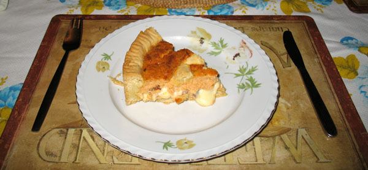
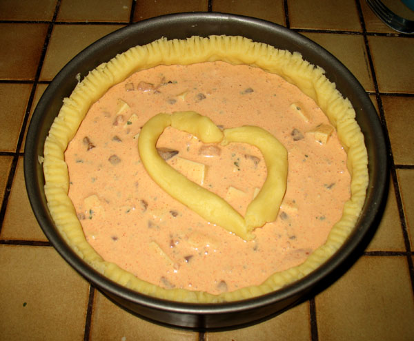
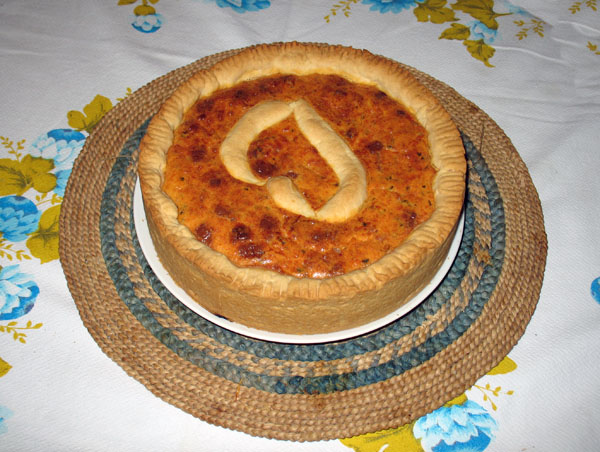

===============
Quiche lorraine
===============

Tijesto
-------
* 20 dag putra, omekšanog
* 40 dag oštrog brašna
* pola žličice soli
* 1 prašak za pecivo
* 2 žlice milerama

Dobro umijesiti sve sastojke osim milerama u prhko tijesto. Dodati mileram i
mijesiti dok se ne dobije glatko tijesto koje se odvaja od podloge. Pustiti da
odstoji dok se priprema fila.

Fila
----
* 3 jaja
* 3 dl milerama
* 20 dag sira, narezanog na kockice
* 2-3 šnite bijelog špeka, narezanog na kockice
* 2-3 šnite suhog mesa, narezanog na kockice
* nasjeckani peršin
* 2 žličice slatke crvene paprike

Bijeli špek popržiti u lončiću par minuta da pusti mast, dodati suho meso i
pržiti još par minuta. Paziti da ne zagori. Pustiti da se ohladi.

Umiješati jaja i mileram. Dodati papriku, peršin, sir i ohlađeni špek i meso.
Po potrebi posoliti (ako suho meso i špek nisu dovoljno slani).

Ovo je klasični recept za filu, ali razne varijacije su moguće. Neki od
preporučenih sastojaka su:
* špinat
* šunka
* tikvice ili patlidžan (potrebno je izvući što više vode prvo)
* sušeni paradajz
* gljive

Priprema
--------
* 1 žlica prezli

Razvaljati tijesto u sloj debeo cca 1cm i obložiti njime formu za torte sa svih
strana. Dno prekriveno tijestom posuti prezlama. Nakon toga uliti filu i
rasporediti je jednakomjerno. Eventualni višak tijesta aranžirati na vrh u
trakicama kao ukras.

    Prije pečenja.

    Nakon pečenja.

