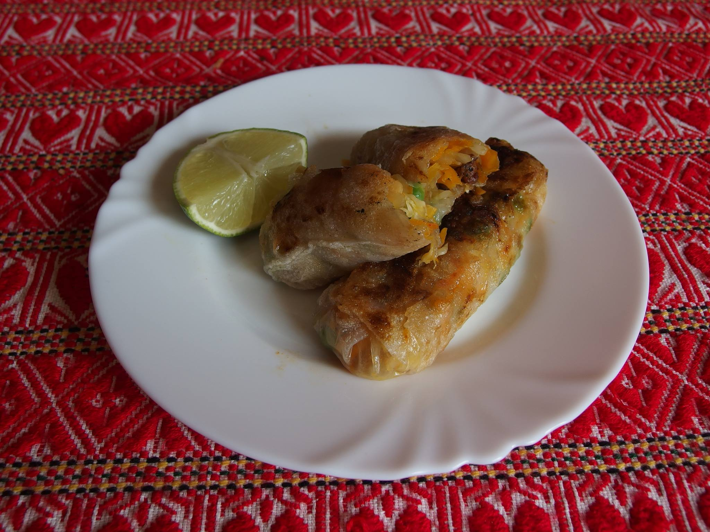
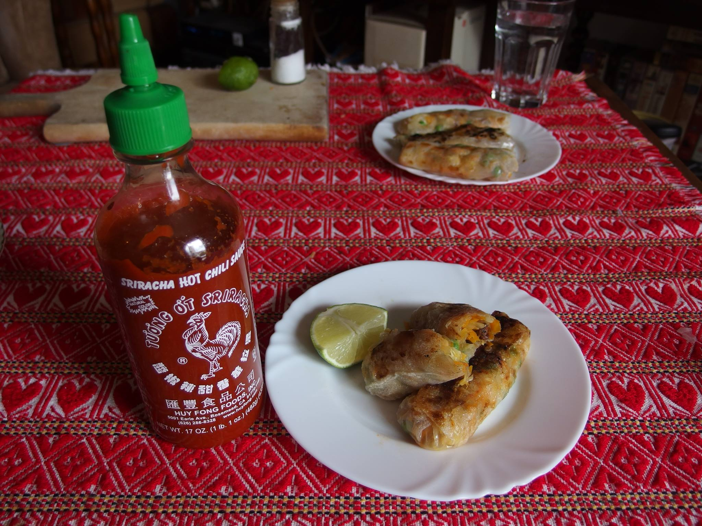

============
Spring rolls
============

Za ovaj recept možete koristiti sastojke u potpunosti po vašem izboru. Odlično
ispadne i povrtna varijanta, i s tofuom umjesto mesa. Ovdje samo navodim što sam
koristio zadnji put kad sam radio recept.

Količina dovoljna za 12tak rolica, iliti dvije osobe.

Meso
----
* 250g pilećih zabataka

Koristio sam pileće zabatke koji su mi puno ukusniji od bijelog mesa. Zabatke
filterirati (ili kupiti filtetirane), ukloniti kožu i izrezati na trakice.

Narezano meso staviti u vrećicu za frizer s žlicom ulja i malo soli. Opcionalno
dodati začine. Ja sam stavio žlicu soja sosa i žličicu smeđeg šećera ili meda
(dodavanje slatkog malo glazira i karamelizira kod prženja). Ostaviti da se
marinira dok spremate povrće.

Povrće
------
* luk, prepolovljen i nasjeckan na polukružne trakice (ne pretanko)
* mrkva, naribana
* kupus, narezan na trakice
* grašak, skuhan

Što se tiče doziranja gorenavedenog, uzeo sam 2 srednja luka i približno
jednaku količinu ostalog povrća.

Sljedeće sastojke nasjeckati i pomiješati:

* 4 češnja češnjaka
* đumbir, oko 5cm korjena
* galangal, oko 2cm korijena (opcionalno, teško za naći)
* čili papričice (po želji)

Priprema
--------
Posoliti narezani kupus i pustiti da odstoji kako bi se opustio.

Marinirano meso baciti na jako zagrijanu tavu. Ulja bi trebalo biti dosta u
marinadi (barem za teflonsku tavu). Pržiti dok ne karamelizira i bude lijepe
smeđe boje, oko 5 minuta. Izdvojiti na stranu i pustiti da se hladi.

U ostatak masnoće u od mesa staviti narezani luk i pržiti na srednje jakoj vatri
oko 5 minuta, zatim dodati pola mješavine đumbira, češnjaka, galangala i čilija.
Pržiti još kratko dok luk ne počne dobijati boju. Izdvojiti pustiti da se
malo ohladi. Cilj je da se luk malo karamelizira, ali da ne bude posve mekan.

Sve povrće pomiješati zajedno. Meso ostaviti sa strane.

Rižin papir jedan po jedan namakati u vodi oko 30 sekundi, dok ne omekša
dovoljno da se može lagano savijati. Rasprostrti list naočenog papira na
dasku, staviti oko 1 žlice miješanog povrća i nekoliko komadića mesa. Zamotati
u rolice zatvorene s obje strane. Dobar tutorial kako motati ima
`ovdje <http://whiteonricecouple.com/recipes/how-roll-fresh-spring-rolls/>`_
("closed end" način).

Rolice slažite tako da se ne dodiruju jer će se zalijepiti i potrgati.

U ovom trenutku rolice su jestive i ukusne (vijetnamski stil), ali mogu se
i prepržiti kako bi dobile hrskavu koricu  (kineski stil).

Ako ćete pržiti, svaku rolicu premazati tankim slojem ulja. Tako će se bolje
zapržiti i neće se lijepiti za sve što taknu. Ubaciti u vruću teflonsku tavu
bez dodanog ulja i pržiti nekoliko minuta na svakoj strani, ili dok ne dobiju
zlatnu boju.

Poslužiti uz chilli sos i limetu. Dobar tek!

Gdje kupiti sastojke
--------------------
* Rižin papir - u `Okusu Azije <https://www.okusi-azije.hr/rizin-papir.html>`_,
  `na eBayu <http://bit.ly/1d9M0HI>`_ ili u azijskim dućanima u inozemstvu.
* Galangal - koliko znam jedino kod `Exotic Kinga <http://www.exotic-king.com/>`_
  kojeg se redovno nađe po sajmovima tipa Proizvodi hrvatskog sela i sl.
* Đumbir - dolac, veći supermarketi
