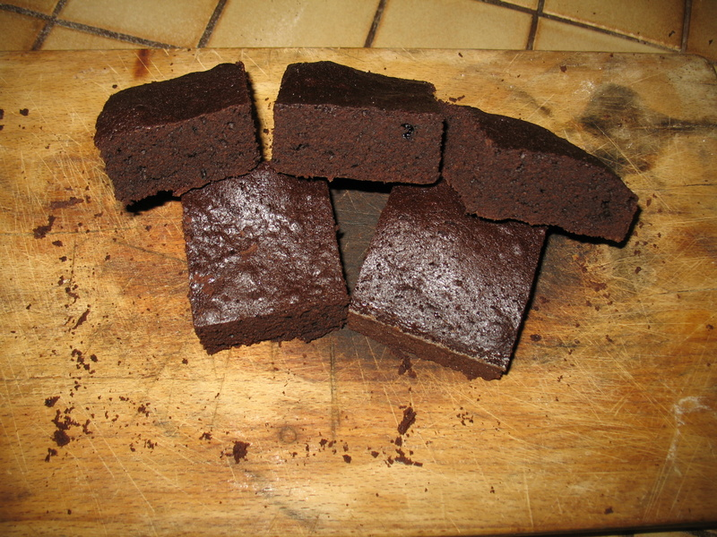

========
Brownies
========

Sastojci
--------
* 18 dag putra
* 18 dag smeđeg šećera
* 10 dag kakaa u prahu
* malo soli
* žličica ekstrakta vanilije
* 3 jaja
* 16 dag brašna

Priprema
--------
Pomiješati šećer, sol i kakao. Zaliti vrućim rastopljenim putrom i
umiješati. Dodati vanilin. Umiješati jaja jedno po jedno. Dodati brašno i
miješati dok ne bude glatka smjesa.

Manji kvadratni protvan namazati putrom pa brašnom. Prebaciti smjesu u protvan
i peći ~15 min na 160°C. Dok igla zabodena u smjesu ne izađe sa samo malo
mrvica na sebi.

Preuzeto i adaptirano sa:
http://foodwishes.blogspot.com/2011/12/chocolate-mint-brownies-behold-tree-of.html