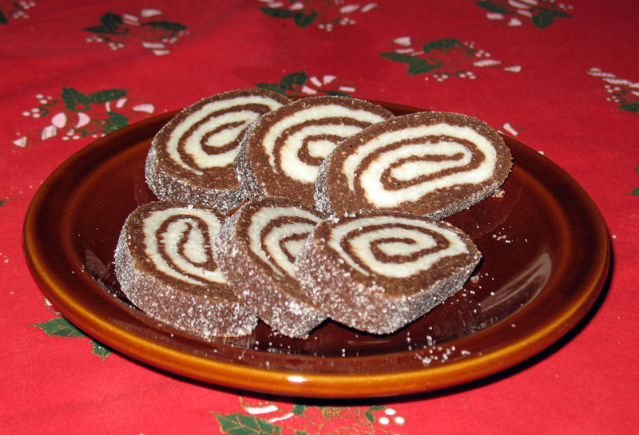
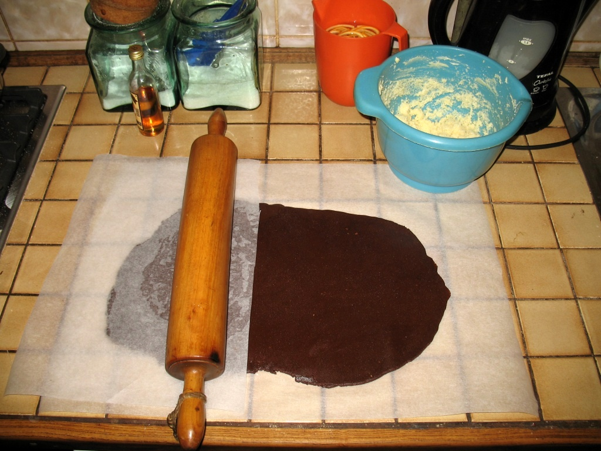
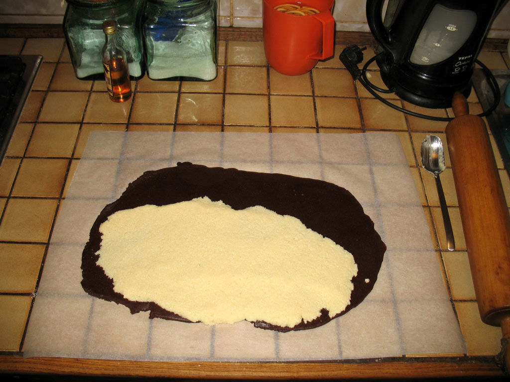
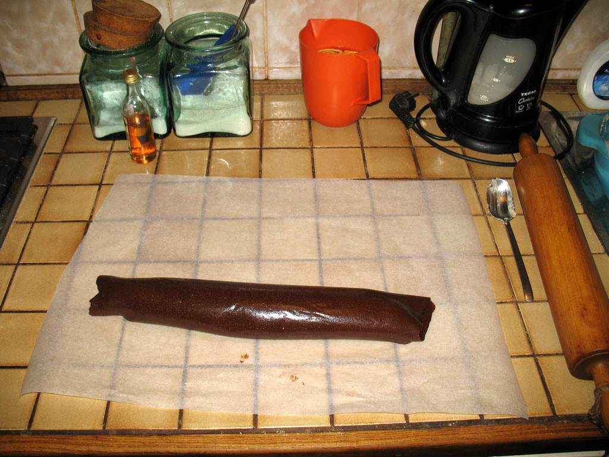

============
Kokos rolada
============

Meni jedan od najdražih božićnih kolača. Naročito kad se malo pretjera s rumom.
:)

Tamna krema
-----------
* 25 dag mljevenih Petit Beurre keksi
* 10 žlica crne kave
* 10 dag šećera
* 10 dag čokolade
* 1 žlica kakaa
* 1-2 žlice ruma

Čokoladu otopiti na pari. Sve sastojke umiješati zajedno dok se ne dobije glatka
smjesa.

Svijetla krema
--------------
* 10 dag kokosovog brašna
* 5 žlica vrele vode
* 3 žlice šećera
* 12 dag putra

Putar ostaviti vani da omekša pa ga razraditi mikserom par minuta. Kokosovo
brašno preliti vrućom vodom i dobro promiješati. Ubaciti kokos i šećer u putar i
umiješati sve mikserom.

Proces
------
Tamnu smjesu razvaljati u oblik duguljastog pravokutnika omjera stranica 1:2
(vrlo približno - vidi sliku). Pošto se smjesa jako lijepi, najlakše je staviti
je na komad papira za pečenje i pokriti je drugim komadom pa onda valjati.

Bijelu kremu razmazati po donje dvije trećine tamne kreme. Opet se može
koristiti papir za pečenje i valjak.

Koristeći se papirom, zamotati kreme u roladu.

Krajeve rolade zatvoriti rukom. Uvaljati u kokosovo brašno dok se ne prestane 
loviti, kako rolada ne bi bila ljepljiva. Najbolje zamotati u aluminijsku foliju
da se ne osuši kod dužeg stajanja (što rijetko doživi). Držati u frižideru.
