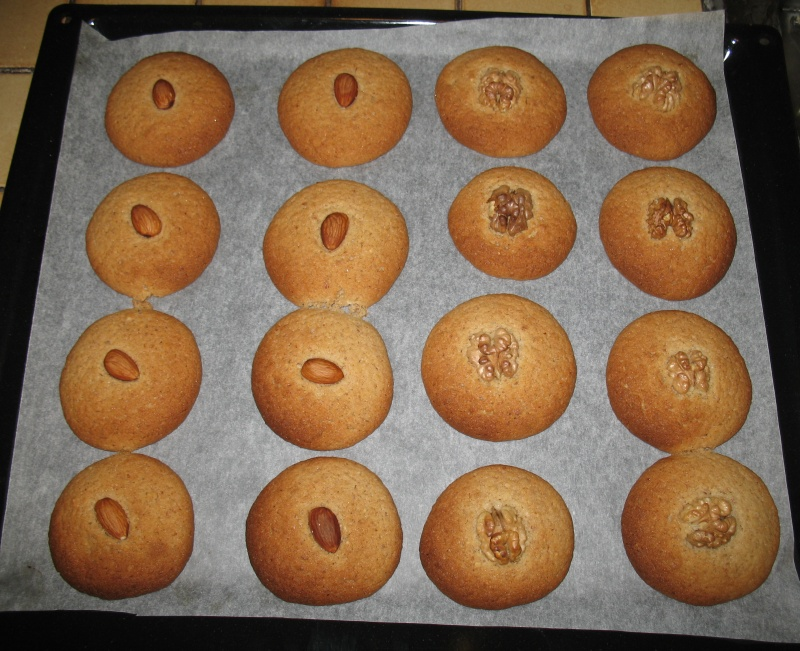

=========
Medenjaci
=========

* 35 dag brašna
* ½ vrećice praška za pecivo
* 15 dag putra
* 20 dag šećera
* 2 jaja
* 10 dag mljevenih oraha ili badema
* 1 žličica cimeta
* 3 žlice meda
* korica 1 limuna, naribana

Opcionalno:

* cijeli orasi ili bademi za ukras

Prašak za pecivo jednakomjerno umiješajte u brašno. Putar ostavite van
frižidera da omekša, pa ga zajedno s brašnom dobro izmrvite. Zatim dodajte
šećer, jaja, mljevene orahe, med, cimet, struganu koru limuna i sve dobro
izradite u glatko tijesto. Pustite tijesto da odstoji na hladnom mjestu 1 sat.
Od tijesta oblikujte veće valjke koje ćete izrezati na jednakomjerne komade
veličine oraha. Oblikujte kuglice, složite ih u protvan prekriven papirom za
pečenje, malo ih spljoštite. Po želji ukrasite s polovicom jezgre oraha ili
bademom.

Pecite na 220°C oko 20 min, dok ne porumene. Ako se koristi pećnica sa
puhalicom, mogu se peći na dva kata i to na temperaturi od 200° 12-13 minuta.

Količina je dovoljna za cca. 30-40 keksa.

Preuzeto iz: "Domaći kolači", Biluš, Rodé, Božić
