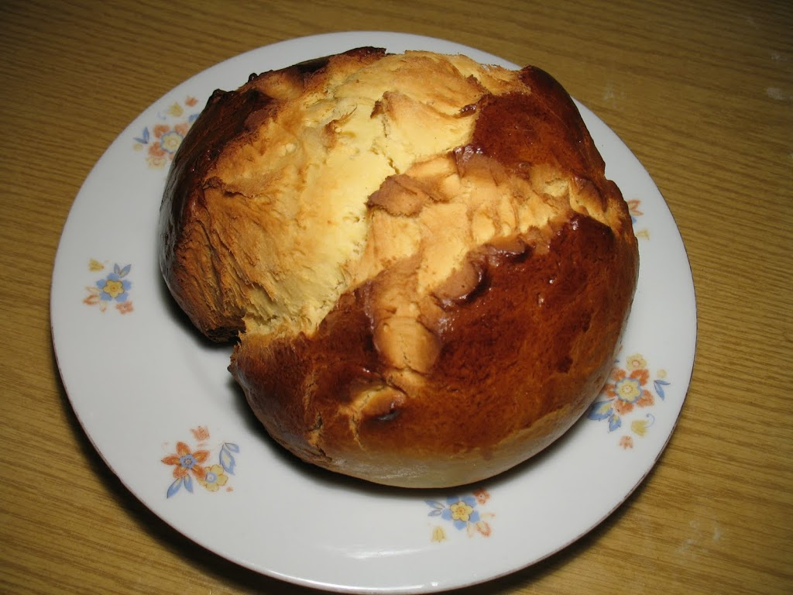

=====
Pinze
=====

Količina: 3 pinze promjera ~20cm

Vrijeme pripreme: 3h

Za pinze, kao i sva dizana tijesta, poželjno je unaprijed sve sastojke ostaviti
nekoliko sati u zagrijanoj prostoriji da ne budu hladni. Prostorija u kojoj se
mijesi mora biti na lagano povišenoj temperaturi i ne smije biti propuha.

Smjesa za kvasac
----------------
* 8 dkg svježeg kvasca (2 kockice)
* 2,5 dcl mlakog mlijeka (ne smije biti vruće)
* žlicica soli
* žličica šećera 
* žličica brašna

Umiješati sastojke, pokriti krpom  i ostaviti da stoje na toplom mjestu da se
kvasac aktivira.

Smjesa za pinze
---------------
* 1 kg oštrog brašna
* 16 dkg putra, rastopljenog
* 25 dkg šećera
* 2 vanilin šećera
* 6 žumanjka
* 2 cijela jaja
* naribana korica od 1 limuna i 1 naranče
* par žlica ruma

Dodatno
-------
* 10tak dag brašna za posipanje
* 1 jaje, izmućeno za premazivanje

Proces
------
Tradicionalna taktika izrade tijesta je da se brašno i šećer pomiješaju na 
ravnoj podlozi (npr. na stolu) te se u toj smjesi izdubi rupa omeđena sa svih 
strana. U sredinu se zatim stavljaju redom jaja, korice, rum, vanilin šećer, 
putar, kvasac. Kako se dodavaju tekući sastojci tako ih polako kombinirati 
(npr. vilicom) sa brašnom sa unutrašnjih bridova "nasipa" kako ne bi procurili 
van. Pomalo, brašno će upiti svu tekućinu. 

Tijesto zatim mijesiti rukama, dodavajući brašno po potrebi da se smjesa ne 
ulijepi. Ruke od ljepljive smjese povremeno čistitit brašnom. Nastaviti 
mijesiti i polako dodavati brašno dok se smjesa skoro sasvim prestane lijepiti 
za podlogu. Nastaviti mijesiti bez dodavanja brašna (osim minimalno) još 
desetak minuta sve dok se pod rukama ne osjeti da "pucketa" tj. da se počinju 
oslobađati mjehurići zraka (osobno ja mjehuriće ne detektiram, već nakon 10 
minuta proglasim da mi se više ne da, op. ur.). 

Podijeliti tijesto na tri jednaka dijela, te ih oblikovati u pogače, pokriti 
krpom i ostaviti da stoje na toplom mjestu jedno sat vremena da se tijesto 
digne. 

Pećnicu zagrijati na 200°C. Svaku pinzu premijesiti i ponovo formirati u 
pogaču. Posložiti 3 pinze u protvan na papir za pečenje. Pinze pomoću kista 
premazati razmućenim jajetom te škarama ili nožem izrezati tri cik-cak linije 
od sredine prema rubu pinze (visi slike) kako bi pravilno pukle kod pečenja. 
Protvan staviti u pećnicu i peći 10 minuta na 200°C, dok pinze ne porumene. 
Nakon toga smanjiti temperaturu na 180°C i peći daljnih 20-25 minuta. Kada 
pinze poprime tamniju smeđu boju, isprobati iglom jesu li pečene iznutra. Ako 
se na igli zadržava tijesto (što znači da pinza nije pečena) prekriti ih 
alu-folijom da ne zagore i peći dalje dok se potpuno ne ispeku. 

Galeriju pripreme pogledajte ovdje:
https://plus.google.com/photos/115278067030076084937/albums/5597402085153596945